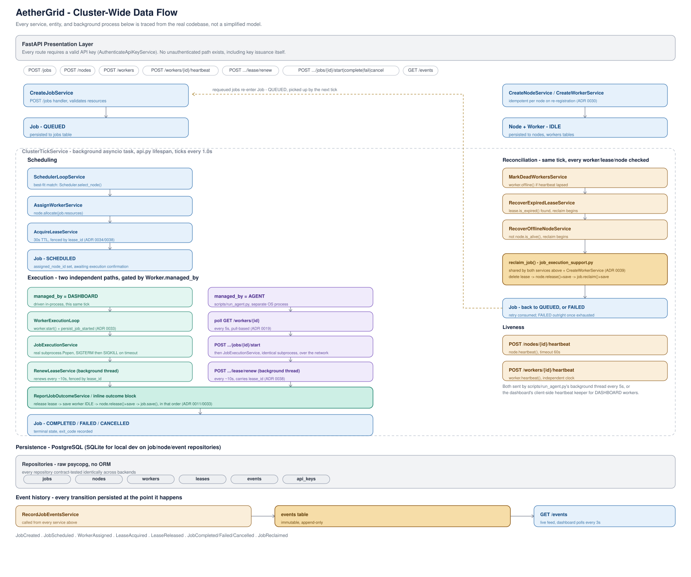

<p align="center">
  
</p>

<p align="center">
  A distributed AI workload orchestrator built around the problems that make scheduling hard at scale: exclusive execution ownership under failure, reconciliation after partial failures, and enforced resource limits. Not a CRUD tutorial with a scheduler theme.
</p>

<p align="center">
  <a href="#test-coverage"></a>
  <a href="#engineering-decision-records"></a>
  <a href="#license"></a>
  <a href="#tech-stack"></a>
  <a href="#tech-stack"></a>
  <a href="#tech-stack"></a>
  <a href="#tech-stack"></a>
  <a href="#tech-stack"></a>
  <a href="https://aethergrid-dashboard.onrender.com"></a>
</p>

AetherGrid takes workloads, matches them against available compute nodes based on resource requirements and constraints, and manages the full lifecycle: queued, scheduled, running, completed, failed, retried, cancelled. Jobs run through workers registered against nodes, and job execution ownership is enforced through time-bound leases rather than a simple assignment flag. Every route requires API key authentication, including the endpoint that issues keys.

<p align="center">
  <a href="https://raw.githubusercontent.com/wycliffRotich-dev/aethergrid/main/docs/assets/aethergrid-data-flow.svg" target="_blank">
    
  </a>
</p>
<p align="center"><sub>Click the diagram to open it full-size.</sub></p>

**Try it live**: the full console is deployed and reachable at [aethergrid-dashboard.onrender.com](https://aethergrid-dashboard.onrender.com) with real Postgres, real auth, and real API-key-gated endpoints.

---

## Why This Exists

Most scheduler side-projects are a single `main.py` script wrapped in a `while True` loop polling an in-memory dictionary. They work fine, right up until you need to swap the persistence engine, add a new constraint type, or figure out why a job silently disappeared, or why two workers picked up the same job at once.

AetherGrid was built around one rule: **the domain logic doesn't know or care where the data lives.** Jobs, nodes, workers, and the allocation algorithm are pure Python with zero infrastructure dependencies. The database is a detail, not the foundation. This project is a concrete demonstration that these architectural patterns aren't just conference-talk vocabulary; they're guardrails that keep a codebase understandable as it grows, and as its correctness requirements get harder.

---

## Engineering Decision Records

Every non-obvious decision in this codebase, why a domain rule lives where it does, why an obvious-looking shortcut was rejected, what broke and how it got fixed, is written down at the moment it was made, not reconstructed afterward for a portfolio. 65 ADRs live in [`/docs/adr`](docs/adr). A few worth reading directly if you want to see the reasoning, not just the conclusion:

- [**ADR 0007 - Reconciliation Loop**](docs/adr/0007-reconciliation-loop.md): how the system detects and repairs state left inconsistent by dead workers and expired leases, instead of assuming the happy path is the only path.
- [**ADR 0011 - Job Reclaim and Reconciliation Repair**](docs/adr/0011-job-reclaim-and-reconciliation-repair.md): closing a real race condition where a dying worker's lease renewal could land after reconciliation had already started reassigning its work.
- [**ADR 0012 - Real Job Execution**](docs/adr/0012-real-job-execution.md): building genuine subprocess execution with enforced timeouts, then deliberately keeping it unreachable from the public API until the system had authentication, and proving that absence with a test rather than a comment.
- [**ADR 0014 - Continuous Lease Renewal**](docs/adr/0014-continuous-lease-renewal.md): why a lease is renewed continuously for a job's entire runtime instead of once at acquisition.
- [**ADR 0015 - API Key Authentication**](docs/adr/0015-api-key-authentication.md): why opaque server-issued tokens were chosen over JWTs for a system that needs instant revocation, and why building authentication still didn't answer whether `Job.command` should be exposed, that question stayed open until [ADR 0020](docs/adr/0020-expose-job-command-to-authenticated-agents.md), which resolved it narrowly: a worker can read the one command already assigned to it, nothing broader.
- [**ADR 0018 - Domain Owns Scheduling Policy**](docs/adr/0018-domain-owns-scheduling-policy.md): why `list_available()` moved out of the repository entirely, since deciding which nodes are eligible for scheduling is a business rule, not a persistence concern, and letting infrastructure decide that would have made scheduling behavior dependent on which database backend was running.
- [**ADR 0019 - Standalone Worker Agent Process**](docs/adr/0019-standalone-worker-agent-process.md): replacing in-process job execution with a real out-of-process agent that confirms its own execution start over the network, and why pull-based polling was chosen over push delivery, since it reuses reconciliation this codebase already trusts instead of introducing new failure and delivery-guarantee logic.
- [**ADR 0029 - Cancel a Running Job by Reusing Lease Renewal**](docs/adr/0029-cancel-running-job-via-lease-renewal.md): extending an existing, already-trusted channel (lease renewal) to deliver cancellation to a running job's subprocess, instead of adding a second polling mechanism, and introducing an explicit CANCELLING status so a job caught mid-cancellation is a visible, real state rather than indistinguishable from one still running.
- [**ADR 0030 - Idempotent Worker Registration Per Node**](docs/adr/0030-idempotent-worker-registration-per-node.md): keying worker identity to node identity so an agent restarting reclaims its existing worker instead of leaving a permanently dead row behind, using the same recovery path reconciliation already trusts, closing a gap before fleet-scale restart churn could ever expose it.
- [**ADR 0031 - Reclaim a Job Abandoned Mid-Cancellation**](docs/adr/0031-reclaim-a-job-abandoned-mid-cancellation.md): finalizing a job as CANCELLED, with no retry consumed, when its worker dies before confirming a cancellation already in progress, instead of leaving it stranded in CANCELLING forever or silently retrying a stop nobody asked to undo.
- [**ADR 0032 - Move Cluster Tick Execution Off the Event Loop**](docs/adr/0032-move-cluster-tick-execution-off-the-event-loop.md): running the cluster tick on a worker thread via asyncio.to_thread once real, caller-controlled commands could run for an unbounded duration, so one long-running job can no longer stall every other request the server would otherwise serve.
- [**ADR 0033 - Persist a Job's RUNNING Transition Immediately After worker.start()**](docs/adr/0033-persist-job-started-immediately-after-worker-start.md): closing a gap independently rediscovered twice, WorkerRepository.save() only ever writes the workers table, so a job's own row silently stayed SCHEDULED for its entire real execution unless something separately persisted it, extracting a single shared function instead of patching the second occurrence in isolation.
- [**ADR 0034 - Fence Lease Release by Lease Identity, Not Just Worker Identity**](docs/adr/0034-fence-lease-release-by-lease-identity.md): closing a gap one level upstream of what ADR 0014 had already named and deferred, releasing a lease checked only that a worker held some lease, not that it was the same one the caller had been renewing, letting a stale caller delete a different, legitimately-held lease out from under whoever actually owned it, verified with a test that proved the unsafe delete happening before any fix landed.
- [**ADR 0035 - Delete a Job's Lease Before Reclaiming It in RecoverOfflineNodeService**](docs/adr/0035-delete-lease-before-reclaiming-offline-node-jobs.md): the third independent occurrence of the same shape in one session, a sibling service (RecoverExpiredLeaseService) already had the correct pattern, and this one hadn't inherited it, silently stranding every job recovered from an offline node since its stale lease was never deleted, verified with a test that proved the strand before any fix landed.
- [**ADR 0036 - Fence Standalone-Agent Outcome Reports by Lease Identity**](docs/adr/0036-fence-outcome-reports-by-lease-identity-for-agents.md): closing the one limitation ADR 0034 named rather than claimed to cover, the external HTTP contract a standalone agent uses to report a job's outcome carried no lease identity at all, so a stale report could never be distinguished from a current one. `lease_id` is now a required field, captured by the agent at poll time before execution starts and checked against whatever lease is actually current for the worker, not looked up internally where it could never disagree with itself.
- [**ADR 0037 - Verify Lease Fencing Against a Real, Reconstructing Repository**](docs/adr/0037-verify-lease-fencing-against-a-real-repository.md): ADR 0034 and ADR 0036's lease-fencing logic had only ever been proven against `InMemoryLeaseRepository`, which shares object references on read, the same class of gap that produced a false-negative repro attempt during ADR 0033's own development before that bug was proven against SQLite instead. Adds a test reproducing the full lease-theft scenario, acquire, reconcile-reclaim, legitimate reassignment, stale release attempt, against `PostgresLeaseRepository`, with each step run through its own independently constructed repository instance so a shared in-memory reference can't mask the behavior under test.
- [**ADR 0038 - Fence Lease Renewal by Lease Identity, Not Just Worker Identity**](docs/adr/0038-fence-lease-renewal-by-lease-identity.md): the third and final lease-mutating operation to close this gap, after release (ADR 0034) and outcome reporting (ADR 0036). `RenewLeaseService` resolved the current lease by worker_id alone and renewed whatever it found, with no check that the caller's belief about which lease it held still matched reality. Unlike release, a mismatch here is silent rather than destructive: a stale caller renews the wrong lease with no error, potentially masking a real reconciliation failure. Closes both the internal WorkerExecutionLoop path and the external `POST /workers/{worker_id}/lease/renew` contract in the same change, since renewal is the standalone agent's repeated heartbeat mechanism, not a one-time terminal call like release.
- [**ADR 0039 - Fully Reclaim an Abandoned Job on Worker Re-registration**](docs/adr/0039-fully-reclaim-abandoned-job-on-worker-reregistration.md): ADR 0030 accepted, at the time, that reclaiming a worker on agent restart would silently discard its abandoned job, calling that a mirror of reconciliation's own recovery behavior. That mirror stopped being accurate the moment reconciliation was fixed to always release a node's resources and delete a stale lease before recovering a worker, a pairing worker re-registration never inherited. Left alone, this wasn't only a resource leak: since lease acquisition fences by job identity, not worker identity, and a recovered worker goes idle immediately, it could be reassigned a new job before the old one's lease expired, and that old lease's eventual expiry would then corrupt the new job's tracking instead. Fixed by reusing reconciliation's exact reclaim sequence, lease deletion, resource release, job reclaim, before recovering the worker, verified the same way as the gap it closed: a test proving the corruption before any fix landed.
- [**ADR 0040 - Shared useAsyncResource Hook Closes a Stale-Response Race Present in Seven Hooks**](docs/adr/0040-shared-async-resource-hook-closes-stale-response-race.md): seven frontend hooks each independently reimplemented fetch, error, and loading handling, none of them guarding against a response resolving after a newer fetch had already started, a real race for any hook whose fetch depends on an id or that polls. Closed by extracting one shared hook where refresh() and the automatic fetch share the exact same guarded effect run, rather than two implementations that could quietly drift apart.
- [**ADR 0041 - Recover a Worker from OFFLINE on Heartbeat, Only When It Holds No Job**](docs/adr/0041-recover-worker-from-offline-on-heartbeat-when-idle.md): an idle worker whose heartbeat lapsed had no path back to IDLE at all, every existing recovery route was triggered exclusively by job-recovery services that never fire for a worker with no job to reclaim, observed live when a dashboard tab's heartbeat keeper went idle overnight. Fixed narrowly: heartbeat recovers status only when the worker holds no running job, since an OFFLINE worker still holding one may already be mid-reassignment by reconciliation, the same shape of race ADR 0034, ADR 0036, and ADR 0038 closed for lease identity, one layer up here at the worker level.
- [**ADR 0042 - Heartbeat OFFLINE Workers Too, So ADR 0041's Recovery Path Is Actually Reachable**](docs/adr/0042-heartbeat-offline-workers-to-use-adr-0041-recovery.md): ADR 0041's OFFLINE-to-IDLE recovery was unreachable from the dashboard's own heartbeat keeper, which filtered OFFLINE workers out of every heartbeat cycle on reasoning that predated ADR 0041 and was never revisited once it landed. Observed live: a worker went OFFLINE from ordinary job-cancellation activity rather than a stale timeout, and was then permanently excluded from recovery until the page was reloaded. Fixed by heartbeating every worker regardless of status; this is safe by construction, since ADR 0041 already restricts recovery to workers holding no running job, so heartbeating an OFFLINE worker that still holds one has no effect.
- [**ADR 0043 - Multi-Dimensional Best-Fit Scheduling, Not CPU-Only**](docs/adr/0043-multi-dimensional-best-fit-scheduling.md): `select_node()` broke ties among sufficient nodes using CPU remainder alone, with memory and VRAM playing no role once a node passed the sufficiency check, the wrong dimension to optimize in isolation for a scheduler built around AI workloads where VRAM is frequently the actual binding constraint. The existing best-fit test scaled all three resource dimensions proportionally, so it could never have caught this. Fixed by scoring each candidate on normalized tightness, summed across only the dimensions a job actually requests a nonzero amount of, so a job needing no VRAM is never steered by VRAM it will never touch, and a CPU-only job reduces to the exact comparison that existed before.
- [**ADR 0044 - Agent Retries Transient Failures With Capped Backoff and Jitter**](docs/adr/0044-agent-retries-transient-failures-with-backoff.md): the standalone agent was meant to run unattended but treated most failures as fatal, so one 429, 5xx, or timeout during registration, polling, or outcome reporting killed it, and after a control plane restart every agent failed and came back in lockstep. Worse, lease renewal treated any error as a lost lease, discarding the result of a job that had finished successfully. Fixed by classifying failures: transient ones retry without limit under capped exponential backoff with full jitter that honors Retry-After, a 404 on the poll re-registers, and renewal retries inside a trust window measured from the last confirmed renewal, keeping its only-409-means-lost contract. Verified by stopping the real API, starting an agent, and restarting the API: the agent retried through seven failures and registered on its own.
- [**ADR 0045 - Fleet Agents Use One API Key Per Agent, Not a Shared Key**](docs/adr/0045-fleet-agents-use-one-api-key-per-agent.md): ADR 0044 fixed the agent's own failure handling but named a problem retries cannot fix: rate limiting is per API key, and a shared key across a fleet of agents caps out at roughly 14 concurrent agents before throttling begins. The mechanism to fix this already existed and required no code changes: issue one API key per agent instead of one shared key, since the rate limiter already buckets independently per key. Fixed by documenting per-agent key issuance as the intended pattern in scripts/issue_api_key.py's usage and run_agent.py's docstring, removing the ceiling by using what was already there correctly.
- [**ADR 0046 - Health Endpoint Bypasses the Repository Pattern for a Fast, Explicit Timeout**](docs/adr/0046-health-endpoint-bypasses-repository-for-fast-timeout.md): routing `/health` through `NodeRepository.list()` meant a health check inherited the shared pool's 30-second default connection timeout, since neither `database.py` nor `dependencies.py` overrides it, defeating the purpose of a signal meant to report bad news fast. Fixed by giving `/health` its own accessor to the raw `ConnectionPool` and an explicit 2-second timeout on `pool.connection()`, a deliberate, narrow exception to the repository boundary rather than a precedent. A ~28.86s anomaly observed once during testing was later confirmed, not just observed: the official Postgres image's two-phase startup lets `pg_isready` report healthy against a temporary `initdb` instance before the real instance is up, and the pool's first connection attempts landed in that gap, triggering `psycopg_pool`'s own retry/backoff. Fixed by blocking `lifespan()` on `pool.wait(timeout=30.0)` before the app reports itself started, so no request, including Docker's own healthcheck, can reach the app before its dependency is confirmed reachable. Verified by reproducing the same cold-start gap under debug-level pool logging: `Application startup complete` now logs only after Postgres's real instance is ready.
- [**ADR 0047 - Resilient Client Architecture for Government API Integration**](docs/adr/0047-resilient-gov-api-client.md): AetherGrid is expected to integrate with a government-operated API for an upcoming pilot, but its endpoint, auth mechanism, and rate limits are not yet known, and government infrastructure is known for unpredictable downtime with no on-call engineer to reach on the other side. Fixed by building `GovAPIClient` with exponential backoff and jitter on transient failures, a circuit breaker (closed, open, half-open) that fails fast during sustained downtime instead of retrying indefinitely, and auth-agnostic configuration supporting mTLS and OAuth2 client-credentials so real credentials can be dropped in later without a code change. Verified by a 7-test suite using respx to mock every failure mode in isolation: transient recovery, retry exhaustion, non-retryable client errors, all three circuit breaker transitions, and OAuth2 token acquisition and caching, since no real sandbox exists yet to test against directly.
- [**ADR 0048 - Generalize GovAPIClient into ResilientAPIClient for Reuse Beyond One Integration**](docs/adr/0048-generalize-gov-client-to-resilient-api-client.md): ADR 0047 built a retry, circuit breaker, and auth-agnostic client for a possible pilot integration, but nothing about its actual design was specific to that one counterparty, only its name and folder were. Fixed by renaming GovAPIClient to ResilientAPIClient before any other integration came to depend on it, while the rename was still a pure rename with no call sites to migrate, and rewording its docstrings to describe the general problem rather than one specific third party. ADR 0047 is left unchanged as the historical record of what was actually known and decided at the time; this entry is the follow-up explaining what changed and why, the same pattern ADR 0042 used for ADR 0041.
- [**ADR 0049 - Resilient Client Replays Only Requests That Are Safe to Replay**](docs/adr/0049-resilient-client-replays-only-safe-requests.md): the resilient client retried every HTTP method, so when a response was lost after the server had already acted, a retried POST repeated its side effect and the caller saw a clean success. A characterization test made this concrete: a payment applied twice with no error anywhere. Fixed by deciding per request whether a replay can repeat a side effect: idempotent methods and requests that provably never reached the server are retried as before, a 429 is always retried since the server declined it, and a POST or PATCH that hit a 5xx or a read timeout is not replayed unless the caller supplies an idempotency key. Failures that leave the outcome unknown say so through an `outcome_unknown` flag, so callers reconcile instead of guessing. Verified over real HTTP against a mock partner that applies its side effect before losing the response: a POST without a key charges exactly once, a POST with a key is retried and still charges exactly once, and re-introducing the old behavior fails five tests.
- [**ADR 0050 - Split Liveness From Readiness, and Move Reconciliation Off the Event Loop**](docs/adr/0050-split-liveness-from-readiness-and-move-reconciliation-off-the-event-loop.md): ADR 0032 left `ReconciliationLoop.execute()` running directly on the event loop, reasoning that its work was bounded and fast by construction. That held only while the database was reachable. A stopped database sent it into the connection pool's 30 second default timeout, freezing every request the server handled, including ones with no database dependency at all, once per tick for the duration of any outage. It also meant the container healthcheck saw the app as unhealthy during an outage, turning a database blip into a restart loop under any orchestrator that acts on that. Fixed by moving reconciliation to a worker thread, the same pattern ADR 0032 already used for the cluster tick, and by adding `/livez`, a dependency free liveness probe the healthcheck now polls instead of the database aware `/health`. Verified against a stopped Postgres container over a 130 second window: worst case latency on an unrelated endpoint dropped from ~29s to 0.124s, and the container stayed reported healthy throughout.
- [**ADR 0051 - Bound the Shared Connection Pool's Timeout**](docs/adr/0051-bound-the-shared-connection-pools-timeout.md): every Postgres repository in the application shared one `ConnectionPool` constructed with no explicit `timeout`, silently inheriting `psycopg_pool`'s 30 second default. ADR 0046 had already special-cased `/health` around this, and ADR 0050 threaded reconciliation off the event loop, but neither addressed the pool's own default, so any call during an outage, reconciliation included, still blocked a worker thread for up to 30 seconds, the concrete mechanism behind the thread-pool exhaustion risk flagged as a follow-up to ADR 0050. Fixed by passing `timeout=5.0` explicitly at construction, an order of magnitude below the library default while giving real traffic more patience than `/health`'s 2 second, fail-fast value. Verified in isolation against a non-routable address (30.36s unbounded versus 5.0s bounded) and against a real outage, where a reconciliation failure that previously logged "after 30.00 sec" now logs "after 5.00 sec", reproduced twice in one outage window. Narrows but does not eliminate thread-pool exhaustion under sustained outages; closed as issue #261.
- [**ADR 0052 - Fence Reconciliation's Lease Delete by Expiry at Delete Time**](docs/adr/0052-fence-reconciliation-lease-delete-by-expiry-at-delete-time.md): RecoverExpiredLeaseService reclaimed a job based on a stale snapshot read: it checked whether a lease was expired once, against a list() call taken at the top of its loop, then deleted that lease unconditionally later in the same pass. A worker's background renewal thread renewing the lease in between meant a legitimately-owned, no-longer-expired lease could still be deleted and its job reclaimed out from under its current owner, the same class of bug ADR 0034 fenced for ReleaseLeaseService, but never covered for reconciliation's own delete. Fixed by adding LeaseRepository.delete_if_expired(), a conditional delete that re-checks expiry atomically at the moment of deletion rather than trusting an earlier read, on both backends, and wiring RecoverExpiredLeaseService to skip reclaiming a job entirely when the lease survives that check. Verified with new contract tests on both the in-memory and Postgres repositories, plus a service-level test that simulates the exact race by renewing a lease between construction and execute(). RecoverOfflineNodeService was not touched and is explicitly flagged as an open question, not assumed safe.
- [**ADR 0053 - Fence Offline-Node Lease Delete by Lease Validity**](docs/adr/0053-fence-offline-node-lease-delete-by-validity.md): node heartbeat and lease renewal turned out to be structurally independent signals, confirmed by tracing both WorkerExecutionLoop (lease renewal on its own dedicated thread, no heartbeat call at all) and the standalone agent (heartbeat and renewal on two separate threads, a heartbeat failure never propagated to the renewal thread). RecoverOfflineNodeService never looked up a job's lease at all, reclaiming any job on an offline node's worker unconditionally, so a node could go offline on one missed heartbeat while that worker's lease kept renewing successfully, and its job would still be reclaimed out from under it, the same class of race ADR 0052 fixed elsewhere but explicitly left open here pending evidence. Fixed by checking the job's lease before reclaiming: no lease or an actually expired one proceeds as before, using the same delete_if_expired() from ADR 0052; a still valid lease is left entirely untouched. Verified with a test that constructs exactly that scenario, an offline node with a worker holding a still-valid lease, and asserts the job survives unreclaimed. Closes issue #267.
- [**ADR 0054 - Scope API Keys, and Require jobs:execute to Set Job.command**](docs/adr/0054-scope-api-keys-and-require-jobs-execute-to-set-job-command.md): ADR 0028 exposed `Job.command` through the public API behind a single key tier and named its own revisit trigger, the day a second key exists. That day came with external review and an in-house deployment, and under the single tier any valid key could make a worker run an arbitrary command, with no way to let a key submit ordinary jobs without that power. `ApiKey` now carries a `scopes` set drawn from a closed vocabulary, empty by default, and setting `command` requires `jobs:execute`, checked with `is None` rather than truthiness so an empty list cannot slip past the gate. Every pre-existing key loses the ability until it is deliberately reissued with `--scope jobs:execute`, and scopes can be granted only through `scripts/issue_api_key.py`, never over HTTP, since otherwise any key could mint itself the scope. An audit of every path that can set a command found `POST /jobs` is the only one. Verified by mutation, not only by passing tests: removing the check, switching to a truthiness gate, dropping scopes in the service, and dropping them in the Postgres `save()` each fail exactly the tests written to catch them.
- [**ADR 0055 - Scope API Key Issuance and Revocation**](docs/adr/0055-scope-api-key-issuance-and-revocation.md): ADR 0054 closed the path where any key could make a worker run an arbitrary command, and recorded a second gap as a follow-up rather than fixing it immediately: `POST /api-keys` and `POST /api-keys/{id}/revoke` had no scope check at all, so any valid key could mint a new key with any scope, or revoke any other key, including the one authenticating the request. `ApiKey` has no ownership field, so there was no notion of a key managing only keys it issued to violate; every key stood in the same flat trust relationship to every other key. A new `keys:manage` scope now gates both routes, checked by a pure `authorize_key_management` function mirroring `jobs:execute`'s gate, with no unscoped fallback since issuing and revoking are the entire surface of that router. `scripts/issue_api_key.py` needed no changes, since its `--scope` flag already validates against the shared scope registry. Ownership (a key may revoke only keys it issued) was considered and deferred to its own ADR, since it needs a schema change and a migration decision for keys issued before ownership existed; a flat `keys:manage` gate already closes the reported gap on its own.
- [**ADR 0056 - Allow a Key to Revoke Keys It Issued, Without keys:manage**](docs/adr/0056-scope-api-key-revocation-by-ownership.md): ADR 0055 closed the path where any key could issue or revoke any other key, but left `keys:manage` as a flat, all-or-nothing scope: a key that only needs to clean up sub-keys it issued itself had no narrower option than the same broad scope an operator uses to administer the whole fleet, a gap ADR 0055 named directly in its own Follow-ups. `ApiKey` now carries `issued_by`, set once at issuance to the authenticated caller that requested it, `None` for every key issued before this column existed or issued by `scripts/issue_api_key.py`'s bootstrap path. A key may now revoke a key it issued without holding `keys:manage`, while `keys:manage` remains a full override reaching any key regardless of ownership. The authorization decision for revocation moved from the route into `RevokeApiKeyService`, the one deliberate departure from this codebase's convention that the gate lives at the route, because deciding ownership requires the target's `issued_by`, a fact that does not exist until the target is loaded, and no route in this codebase holds its own repository access. The decision itself stays a pure domain function, `authorize_key_revocation`; only which layer calls it changed.
- [**ADR 0057 - List the Keys a Key Has Issued**](docs/adr/0057-list-keys-issued-by-a-key.md): ADR 0056 let a key revoke the keys it issued without holding `keys:manage`, but gave no way to see which keys that was. The ownership relationship was enforceable but not visible: an operator or an owning key could not ask what a given key had created short of a direct database query, a gap ADR 0056 named in its own Follow-ups. `GET /api-keys/{id}/issued` now returns every key whose `issued_by` equals the id in the path, revoked keys included so the list is the full issuance history. Authorization mirrors ADR 0056's revocation shape: a caller holding `keys:manage` may list any key's issued keys, and a caller may list its own with no scope at all, since viewing is a strictly smaller right than revoking. The decision is a pure domain function, `authorize_key_view`, and the service loads the requested issuer before authorizing, the same not-found-before-authorization ordering `RevokeApiKeyService` uses, so a caller without rights over an id learns only whether it exists. The response never includes `key_hash` or `issued_by`. The repository gained `list_issued_by`, backed by a new `idx_api_keys_issued_by` index. Results are capped at 100 rather than paginated, with no truncation indicator in the response, a limit the ADR records as acceptable for now and lists as a follow-up.
- [**ADR 0058 - Harden the Container Defaults and Keep Credentials Out of the Repository**](docs/adr/0058-harden-container-defaults-and-keep-credentials-out-of-the-repo.md): the image ran as root, compose hardcoded the Postgres password and published both ports on every host interface, and a shell-form `CMD` left `/bin/sh` as PID 1, so `docker stop` sent SIGTERM to a shell that never forwarded it, waited out the full 10 second grace period, and SIGKILLed the app before its lifespan teardown could close the database pool. Fixed by running as a numeric non-root user, requiring `POSTGRES_PASSWORD` from a gitignored `.env` and refusing to start without it, binding both ports to 127.0.0.1, pinning the Postgres image by digest, and using `exec` so uvicorn is PID 1. The test suite gained a guard that refuses any database whose name does not end in `_test`, since the presentation fixtures run `TRUNCATE ... CASCADE`. Verified by measurement: `docker stop` went from 10.5s to 0.9s with the full shutdown sequence in the logs, compose fails with a message naming the missing variable, and the Postgres tests fail immediately and readably when the test URL is unset. A read-only root filesystem, dropped capabilities and secrets files are recorded as follow-ups, not applied.
- [**ADR 0059 - Run the App Container Read-Only With No Capabilities**](docs/adr/0059-run-the-app-container-read-only-with-no-capabilities.md): ADR 0058 moved the app to a non-root user but left its filesystem writable and Docker's default capability set available to anything that gained privileges, and listed the tighter settings as a follow-up it had not tested. The `neuromesh` service now runs with `read_only: true`, `cap_drop: [ALL]` and `no-new-privileges`. No tmpfs was added, because `docker diff` on the running container listed no written paths after startup and after exercising the API, so there was nothing to give a writable mount. Verified by measurement: `docker inspect` reports all three settings, a write under `/app` fails with "Read-only file system", PID 1's effective and permitted capabilities are all zeros, node, job and worker creation, reads and key revocation succeeded, and the logs held no filesystem errors. The SQLite default backend started under the same restrictions with its database file owned by uid 10001. A row insert through the API on SQLite, a root-owned bind mount, and the same restrictions on Postgres are recorded as follow-ups, not claimed.
- [**ADR 0060 - Enforce Container Hardening in CI and Keep Pins Fresh**](docs/adr/0060-enforce-container-hardening-in-ci-and-keep-pins-fresh.md): ADR 0058 and ADR 0059 hardened the container, but every property was verified by hand, so a later change could undo one unnoticed, and the pinned digests and action versions would go stale silently. A separate workflow now starts the compose stack with a generated password on every push and pull request and fails if the app stops running as uid 10001 with no effective capabilities, loses its read-only root, `CapDrop=[ALL]` or `no-new-privileges`, writes to its own filesystem, or stops shutting down gracefully within 3 seconds. Runners are pinned to `ubuntu-24.04`, and Dependabot covers the docker, docker-compose, github-actions, pip and npm ecosystems, with Python and Postgres majors ignored on purpose. Two frontend majors are held back after they broke the build: `typescript` 7 fails `npm ci` against `typescript-eslint`'s peer range, and `tailwindcss` 4 fails `vite build` because its PostCSS plugin moved to a separate package. Verified by failure, not only by passing: a throwaway branch that removed `exec` made the job fail on the stop-timing step with `docker stop took 10207 ms`, after every earlier step passed. Only that one of the six assertions has been shown to fail so far, and the e2e job is skipped on Dependabot pull requests by design, both recorded as follow-ups.
- [**ADR 0061 - Prove the Hardening Checks Can Fail**](docs/adr/0061-prove-the-hardening-checks-can-fail.md): ADR 0060 added a workflow that asserts the container hardening properties, but a check that has only ever passed has not been shown to catch anything, and only the shutdown timing had been seen to fail. Each property was removed on its own throwaway branch, one per branch because the job stops at the first failing step, and the workflow was dispatched on it: dropping `exec` failed the stop-timing step at 10207 ms, dropping `USER` failed the uid step with `app runs as uid 0`, and removing `read_only`, `cap_drop` or `no-new-privileges` each failed the inspect step with its own message. Making `POSTGRES_PASSWORD` optional failed the first custom step in under a second. One observation worth keeping: with `cap_drop` removed the uid and capability check still passed, because a non-root process holds no effective capabilities regardless, so the inspect check is what catches it. Six of the seven checked properties have now been shown to fail on a deliberate break. The seventh, the `docker diff` write check, was verified only at the level of the command it runs, not as a red workflow step, and that gap is recorded as a follow-up.
- [**ADR 0062 - Status of the Hardening Follow-ups**](docs/adr/0062-status-of-the-hardening-follow-ups.md): ADR 0058 to ADR 0061 each ended with follow-ups, and later ADRs restated earlier ones, so the same item could read as open in one place and done in practice. This ADR is the single record of which is which, and it opens nothing of its own. Resolved, with the pull request or run that resolved each: the read-only root and dropped capabilities (#282), the CI job asserting them (#283), a refresh process for the pinned digests through Dependabot (#285), Python 3.12 in the test matrix (#302), a SQLite write and a root-owned bind mount for `/data` (#301), and the Node.js 20 notice on `actions/checkout` (#289). All seven hardening checks have now failed the real workflow on a deliberate break, and the gate also goes red on the `pull_request` trigger, which supersedes the "six of seven" count in ADR 0061. Three items remain open and stay in the ADR that names them, linked and not re-listed: the secrets file for the database password, the same restrictions on Postgres, and running the e2e job on frontend dependency updates.
- [**ADR 0063 - Close the Remaining Hardening Follow-ups**](docs/adr/0063-close-the-remaining-hardening-follow-ups.md): ADR 0062 left three items open, and all three are now done. The e2e job runs on pull requests that touch `frontend/` or `ci.yml`, with both directions shown on real pull requests: it ran on the pull request that edited `ci.yml` and was skipped on one that touched only `docker-compose.yml` (#304). The Postgres service runs read-only with every capability dropped except the four its entrypoint needs, measured against the pinned image, one error at a time (#305). One result worth keeping: `DAC_READ_SEARCH` looked removable on a fresh volume and was not on a copy of real data, so a fresh-volume test alone would have shipped a service that failed on an existing database. The database password is a Docker secret and no longer an environment variable or part of any URL: Postgres reads `POSTGRES_PASSWORD_FILE`, the application reads `NEUROMESH_DATABASE_PASSWORD_FILE`, and a password in both places is a startup error (#306). Checked on the running stack: no password in either container's environment or in `docker compose config`, and the suite passed with the password only in the file. A clean clone following only the README also found a real fault, a restrictive umask making `schema.sql` unreadable to the container, fixed in #308. It opens no follow-ups of its own.
- [**ADR 0064 - Isolate Resources by Tenant**](docs/adr/0064-isolate-resources-by-tenant.md): Proposed, and only partly implemented. Keys now belong to exactly one tenant, with existing keys moved into one explicit default tenant, and the key routes are scoped by tenant (see ADR 0065). Jobs, nodes, workers, leases and events carry no tenant yet, so any valid key can still reach every job, node and worker, and the cluster routes still report the whole fleet. AetherGrid is not multi-tenant today and should not be described as such. The ADR decides how the whole boundary will work: every resource carries a non-null tenant, the tenant comes from the credential and never from the request, repository methods either take a required tenant or are named `_across_tenants` for system actors such as the scheduler, another tenant's resource answers exactly like a missing one, the scheduler never places a job on another tenant's node, and composite foreign keys make the database refuse cross-tenant links. It becomes Accepted only when a test that enumerates every route and a two-tenant test per scoped route pass. The boundary is application and database enforcement inside one shared database, not separate infrastructure, and it does not defend against compromised database credentials.
- [**ADR 0065 - Scope the API Key Repository by Tenant**](docs/adr/0065-scope-the-api-key-repository-by-tenant.md): the first tenancy change gave every key a tenant, but the key routes still looked keys up across tenants, so a caller in one tenant could revoke or list a key in another. Revoke, list-issued and authentication now go through a repository whose methods either take a required tenant or are named `_across_tenants`, and a key in another tenant answers exactly like a missing one. The tenant filter runs before any scope check, so a caller never gets a 403 for a key that exists. Review of the first change found two real gaps: the Postgres upsert and the in-memory save both matched on id alone, so saving an object with another tenant's key id could change that key. Both are fixed, and a save that would touch another tenant's key now raises instead of being ignored. The unused `list_active` was removed instead of renamed, since a fleet-wide read with no caller is what the `_across_tenants` name is meant to rule out. A test reads the parameter types of the repository and fails on any method that is neither scoped nor named `_across_tenants`. Verified by removing the Postgres upsert guard, the in-memory lookup filter and the `_across_tenants` name on the credential lookup in turn, each failing the tests written for it. Only the API key repository is scoped so far, and ADR 0064 stays Proposed.

If you're evaluating whether someone can operate at a systems level rather than a feature level, this is the fastest way to check.

---

## Key Capabilities

- **API key authentication gating every route**: no endpoint in the system, including the one that issues keys, is reachable without a valid credential. The only way to mint the first key is a script run locally with direct database access, never over HTTP, closing the exact self-service-credential hole that pattern would otherwise leave open
- **Job lifecycle management**: explicit state transitions (Queued → Scheduled → Running → Completed/Failed/Cancelled), including cancellation of a job already `RUNNING` via an explicit `CANCELLING` state, with configurable retry policies and priority-aware scheduling, plus cancel and retry actions reachable from the dashboard
- **Per-job lifecycle history**: every job has a dedicated detail page (`/jobs/{id}`) showing its full real event timeline, `JobCreated` through completion, not just its current status
- **Constraint-aware, multi-dimensional best-fit allocator**: matches workloads to nodes based on resource requirements and labels, skipping nodes that are draining or offline, then breaks ties among sufficient candidates by normalized tightness across every resource dimension a job actually requests, CPU, memory, and VRAM together, not CPU alone (see [ADR 0043](docs/adr/0043-multi-dimensional-best-fit-scheduling.md))
- **Node draining**: a healthy node can be taken out of scheduling rotation for maintenance without killing it outright; the scheduler stops assigning it new work while anything already running on it continues to completion
- **Worker registration and heartbeats**: registering a node automatically registers a worker against it, so it's immediately capable of claiming and executing work, not just existing as unused capacity
- **Standalone worker agent with exclusive job ownership**: `scripts/run_agent.py` runs as a real, separate process, polling the API over HTTP for assigned work, executing it as a real local subprocess, and heartbeating on its own background thread for the agent's entire lifetime, independent of whatever job it's currently executing (see [ADR 0019](docs/adr/0019-standalone-worker-agent-process.md)). This replaces the dashboard's client-side heartbeat as the liveness mechanism for any worker running it; a worker with no agent process attached still falls back to node liveness alone. Every worker is tagged with an explicit `managed_by` field set at registration (`DASHBOARD` or `AGENT`); the in-process scheduler loop skips any worker marked `AGENT` entirely, so a standalone agent's jobs are executed exactly once, by the agent, never raced against the in-process path.
- **Lease-based execution ownership**: when a worker accepts a job, it holds a renewable, expiring lease on that job, continuously renewed for the job's entire execution, so retries, reconnects, network failures, and jobs that simply run long can't result in two workers executing the same job
- **Explicit execution-start confirmation**: `POST /workers/{worker_id}/jobs/{job_id}/start` lets whatever is actually executing a job, the in-process scheduler loop for dashboard-managed workers, a standalone agent for agent-managed ones (ADR 0019), confirm execution has genuinely begun. This is the one call that transitions a job from `Scheduled` to `Running`; assignment alone no longer does (see [ADR 0019](docs/adr/0019-standalone-worker-agent-process.md))
- **Real subprocess execution with enforced timeouts**: jobs with a command run as real subprocesses, with a two-stage shutdown (graceful `SIGTERM`, then `SIGKILL` after a grace period) if a job overruns its execution timeout
- **Node liveness tracking**: heartbeat-based health checks, automatic detection of offline nodes, and resource reclamation when work fails or nodes disappear
- **Reconciliation with bounded retries**: jobs abandoned by a dead worker or an offline node are reclaimed back to the queue within their retry budget, and fail outright once that budget is exhausted, so a single unhealthy node can't cause a job to be reassigned and abandoned indefinitely, with the reclaim ordered to close a real race where a dying worker's renewal could land after reconciliation had already started reassigning its lease
- **Domain event recording**: every lifecycle transition a job goes through, `JobCreated`, `JobScheduled`, `WorkerAssigned`, `LeaseAcquired`, `LeaseReleased`, `JobCompleted`/`JobFailed`, and `JobReclaimed`, is persisted as an immutable event at the exact point it happens
- **Live cluster-wide event feed**: `GET /events` and a real-time Activity Feed on the dashboard, polling every 3 seconds, so the story an individual job tells on its own detail page is also visible as it happens across the whole cluster
- **Worker visibility**: a dedicated Workers table showing every registered worker, its status, the node it belongs to, what it's running, and when it was last seen
- **Idempotent worker re-registration per node**: an agent restarting after a crash reclaims its existing worker identity instead of leaving a dead row behind, using the same reclaim sequence reconciliation already trusts, lease deletion, resource release, job reclaim, so an abandoned job is fully cleaned up before the worker is recovered rather than silently discarded (see ADR 0030, ADR 0039)
- **Multi-page dashboard**: real client-side routing (`/`, `/nodes`, `/jobs`, `/jobs/{id}`, `/workers`, `/workers/{id}`) instead of a single page, with active-route highlighting in the sidebar and a global command palette (Cmd+K / Ctrl+K) for jumping between top-level views without touching the mouse

---

## Architecture

The system is split into four layers, with dependencies pointing inward:

**Domain**: `Job`, `Node`, `Worker`, `Lease`, `Event`, and `ApiKey` aggregates enforce their own invariants. The scheduling algorithm and job lifecycle state machine live here as plain Python, with no imports from FastAPI or psycopg. Delete the infrastructure layer entirely and the domain tests still pass.

**Application**: Services such as `ScheduleJobService`/`SchedulerService`, `AssignWorkerService`, `AcquireLeaseService`, `StartJobService`, `DrainNodeService`, `ClusterHealthService`, and `AuthenticateApiKeyService` coordinate domain objects and repositories without embedding business rules that belong one layer down. A `WorkerExecutionLoop` drives a worker through executing its assigned job as a real subprocess, continuously renewing its lease on a background thread for the job's entire runtime, recording the real outcome, and releasing the lease regardless of that outcome. A renewal that fails means the lease has already been reclaimed elsewhere, and the loop discards its result rather than risk persisting it against another worker's in-progress or completed work. A `ReconciliationLoop` catches the failure modes the happy path can't: crashed workers, expired leases, state left inconsistent by infrastructure failures.

**Infrastructure**: PostgreSQL implementations exist for every repository (`Node`, `Job`, `Worker`, `Lease`, `Event`, `ApiKey`, `Tenant`), written with raw `psycopg` instead of an ORM, a deliberate choice to keep query behavior and transaction boundaries visible rather than abstracted away. `Node`, `Job`, and `Event` additionally have SQLite implementations for local development; `ApiKey` deliberately does not, since local development already runs against the same PostgreSQL backend production uses, and a SQLite path would reintroduce the environment drift that consolidation was built to remove. Every repository is validated against a shared **contract test suite** run against each backend it supports, so switching between implementations, or trusting that they behave identically, is a tested guarantee rather than an assumption.

**Presentation**: FastAPI endpoints for jobs, nodes, workers, events, cluster health, and API keys that validate input, call an application service, and return a response. Every route, on every router, requires a valid API key. No business logic lives in this layer. The frontend mirrors the same discipline: `api/*.ts` typed HTTP calls, `hooks/*.ts` data-fetching hooks, and page/component composition, no business logic embedded in components either.

Every non-obvious decision, why domain owns scheduling instead of application, why raw psycopg over an ORM, how job lifecycle transitions are enforced, why leases exist instead of a simple assignment field, why renewal is a strict update rather than an upsert, why opaque tokens were chosen over JWTs, why job commands were deliberately kept unreachable from the public API until authentication existed, then reopened narrowly, first for workers reading only their own assigned job's command ([ADR 0020](docs/adr/0020-expose-job-command-to-authenticated-agents.md)), later for the public `CreateJobRequest` API itself ([ADR 0028](docs/adr/0028-expose-job-command-through-public-create-job-api.md)), is documented as an ADR in [`/docs/adr`](docs/adr).

---

## A Deliberate Security Decision Worth Naming

The execution engine runs real, arbitrary commands as subprocesses with real timeout enforcement. `Job.command` and `Job.exit_code` are fully tested at the service layer. Until recently, neither was exposed through the public `CreateJobRequest` API, a boundary enforced by a test asserting the field's absence, not left as a comment.

Shipping the capability before exposing it was the deliberate call: build it correctly, prove it works, defer the exposure decision until it can be made deliberately rather than by default ([ADR 0012](docs/adr/0012-real-job-execution.md)).

Authentication closed the first gap. Every route now requires a valid API key, and the only way to mint one without already holding one is a script run locally with direct database access, never over HTTP ([ADR 0015](docs/adr/0015-api-key-authentication.md)). That left a sharper question open: what should *any* authenticated caller be trusted to do, given this system runs a single key tier with no role distinction.

That question has been answered twice, narrowly each time. [ADR 0020](docs/adr/0020-expose-job-command-to-authenticated-agents.md) let an assigned worker read the one command already set for its own job, nothing broader. [ADR 0028](docs/adr/0028-expose-job-command-through-public-create-job-api.md) closed the rest: `command` is now settable through the public API, gated by the same key requirement every other route uses. No new credential tier, by design, matching [ADR 0018](docs/adr/0018-domain-owns-scheduling-policy.md)'s stance against building permission systems for risk that hasn't been measured. In production, that risk is scoped to whoever holds a Render Shell-issued key ([ADR 0025](docs/adr/0025-issuing-production-api-keys-via-render-shell.md)), today, exactly one person. ADR 0028 names the exact trigger for revisiting that: the day a second key exists. That trigger has fired. [ADR 0054](docs/adr/0054-scope-api-keys-and-require-jobs-execute-to-set-job-command.md) adds scoped API keys: setting `command` now requires a key explicitly granted `jobs:execute`, every pre-existing key loses it until deliberately re-granted, and the scope can be granted only through `scripts/issue_api_key.py`, never over HTTP.

The pattern holds throughout: build it right, prove it works, name the risk before shipping the exposure, not just wait for the last blocker to clear.

---

## Test Coverage

<p align="center">
  
</p>

The suite spans domain, application, infrastructure, and API layers (see badge above for current count), all passing:

- Full domain logic coverage: job lifecycle, retry policy, constraint matching, node and worker liveness, lease semantics, node draining and the scheduler's exclusion of draining nodes, and API key issuance, revocation, and usage tracking
- Contract tests proving every repository's in-memory, SQLite (where implemented), and PostgreSQL implementations behave identically, including foreign-key-enforced aggregates such as `Worker` and `Lease`, and specifically that lease renewal fails rather than resurrects a lease already reclaimed by reconciliation
- Application service tests for every use case, including lease acquisition, renewal, release, reconciliation repair (both the requeue-with-retries-remaining path and the fail-outright-once-exhausted path), real subprocess execution (including tests that genuinely kill a process that ignores `SIGTERM`, forcing `SIGKILL`, on both the timeout path and the cancellation path), and the full API key lifecycle from issuance through revocation
- Event recording tests proving every lifecycle event fires at the correct point, in the correct order, across the full job lifecycle, scheduling, assignment, lease acquisition and release, completion, failure, and reconciliation reclaim
- API-level tests against real FastAPI endpoints, including the cluster-wide event feed, per-job history, and every route's auth requirement, verified through a real end-to-end request, not mocked

Separately, a Playwright end-to-end test drives the real dashboard against the real API and Postgres, not mocked, reproducing the ADR 0041/0042 worker-recovery incident through an actual browser (`frontend/e2e`). It is verified locally and in this PR's own CI run, not yet part of the standing CI workflow on every push, that wiring is a deliberate, separate follow-up.

These commands assume the setup in [Running It](#running-it) is done first: the secret file, the virtualenv and `pip install -e ".[dev]"`. The Postgres-backed tests need a separate `neuromesh_test` database. The suite refuses to run against any database whose name does not end in `_test`, because some fixtures truncate tables. With the compose Postgres running:

```bash
docker compose up -d postgres
docker compose exec -T postgres psql -U neuromesh -d neuromesh -c 'CREATE DATABASE neuromesh_test'
docker compose exec -T postgres psql -U neuromesh -d neuromesh_test < app/infrastructure/repositories/schema.sql
export NEUROMESH_TEST_DATABASE_URL="postgresql://neuromesh@127.0.0.1:5433/neuromesh_test"
export NEUROMESH_DATABASE_PASSWORD_FILE=./secrets/postgres_password.local
pytest
```

---

## Running It

```bash
git clone https://github.com/wycliffRotich-dev/aethergrid.git
cd aethergrid
mkdir -p secrets
openssl rand -hex 24 | tr -d '\n' > secrets/postgres_password
cp secrets/postgres_password secrets/postgres_password.local
chmod 600 secrets/postgres_password secrets/postgres_password.local
# A restrictive umask (077) checks files out unreadable to the database user in the container.
chmod a+r app/infrastructure/repositories/schema.sql
sudo chown 10001:10001 secrets/postgres_password && docker compose up -d --build --wait --wait-timeout 180
```

This starts the API and a Postgres instance, both reachable from the host only (127.0.0.1). The last line asks for your sudo password once, because the container user must own the secret file, and then waits until both services are healthy. The `.local` copy is for tools you run on the host, which cannot read the original. Follow the logs with `docker compose logs -f`. `docker compose up` fails if `secrets/postgres_password` is missing, and the application reads the same file through `NEUROMESH_DATABASE_PASSWORD_FILE`, so the password is in neither the connection URL nor the container environment. A Postgres volume created by an earlier version keeps its old password: reset it with `docker compose down -v` ([ADR 0058](docs/adr/0058-harden-container-defaults-and-keep-credentials-out-of-the-repo.md)). Issue yourself a key before calling anything, every route requires one. Grant both scopes so nothing is gated during local development (ADR 0054, ADR 0055):

```bash
python -m venv .venv && . .venv/bin/activate
pip install -e ".[dev]"
export NEUROMESH_DATABASE_URL="postgresql://neuromesh@127.0.0.1:5433/neuromesh"
export NEUROMESH_DATABASE_PASSWORD_FILE=./secrets/postgres_password.local
python scripts/issue_api_key.py "local-dev" --scope jobs:execute --scope keys:manage
```

The image defaults to SQLite and stores its database in `/data`, owned by uid 10001. A named volume works as is. If you bind-mount a host directory at `/data` instead, give it to that user first (`sudo chown 10001:10001 <dir>`). A root-owned directory fails at startup with `sqlite3.OperationalError: unable to open database file`.

Run the frontend separately:

```bash
cd frontend
npm install
npm run dev
```

CI runs the full test suite against a live Postgres service on every push. See `.github/workflows`.

---

## Scope

This isn't trying to compete with Kubernetes or Ray at scale. It's a demonstration of how to build a system that stays understandable as it grows: layered correctly, tested honestly, and documented well enough that someone else could pick it up and know exactly why every piece is where it is, including the pieces that are deliberately half-built and marked as such.

---

<p align="right">
<strong>Let's connect</strong>&nbsp;&nbsp;&nbsp;<a href="https://wa.me/254745275288"></a>&nbsp;&nbsp;<a href="https://linkedin.com/in/rotichkipleting"></a>&nbsp;&nbsp;<a href="mailto:celestinerotich969@gmail.com"></a>
</p>
