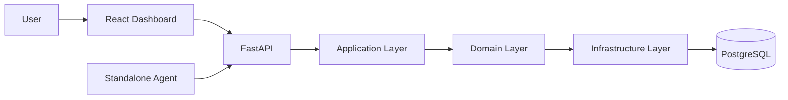

# System Overview

The standalone agent (`scripts/run_agent.py`) is a separate
process that authenticates and calls the API directly, the same
way the dashboard does, not through the browser. It registers,
polls for work, executes jobs as real local subprocesses, and
reports outcomes over the same authenticated REST surface.
